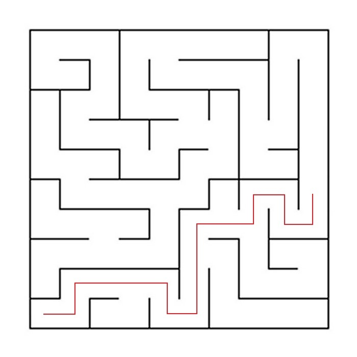
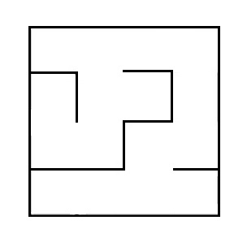
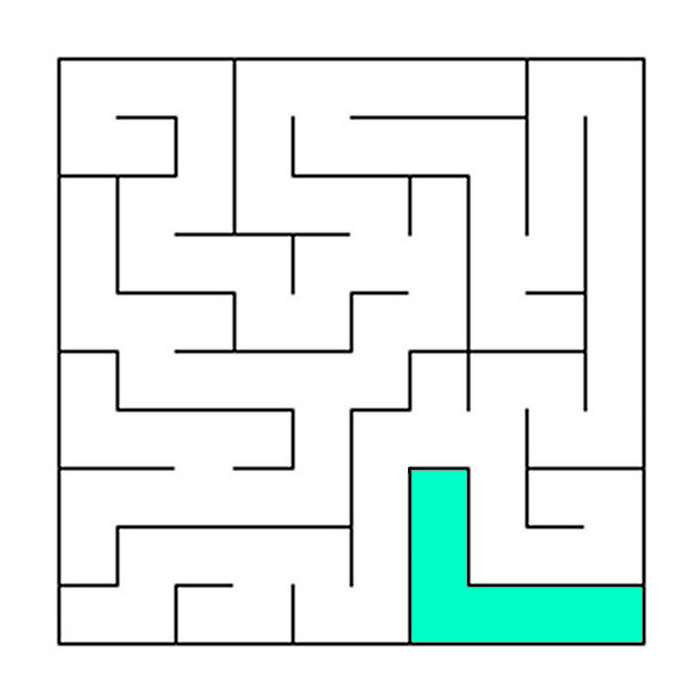
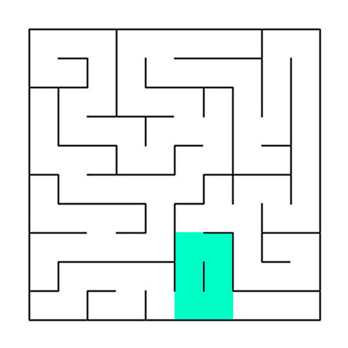
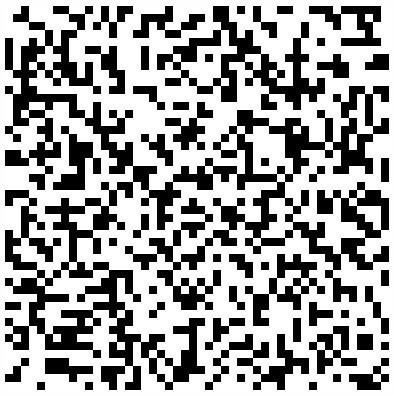
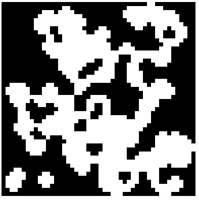

# Maze

Реализация проекта Maze.

## Contents

1. [Chapter I](#chapter-i) \
    1.1. [Introduction](#introduction)
2. [Chapter II](#chapter-ii) \
    2.1. [Information](#information)
3. [Chapter III](#chapter-iii) \
    3.1. [Part 1](#part-1-реализация-проекта-maze)  

## Chapter I
## Introduction

В данном проекте Вам предстоит познакомиться с лабиринтами и сновными алгоритмами их обработки.

## Chapter II
## Information

Лабиринт с "тонкими стенками" представляет собой таблицу размером n строк на m столбцов. 
Между ячейками таблицы могут находиться "стены". Также "стенами" окружена вся таблица в целом. 

Далее приведён пример такого лабиринта:  


Решением лабиринта считается кратчайший путь от заданной начальной точки (ячейки таблицы) до конечной. 
При прохождении лабиринта можно передвигаться к соседним ячейкам, не отделенным "стеной" от текущей ячейки и находящимся сверху, снизу, справа или слева. 
Кратчайшим маршрут считается, если он проходит через наименьшее число ячеек.

Пример лабиринта с его решением:  


В этом примере начальная точка задана, как 10; 1, а конечная, как 6; 10.

## Описание лабиринта

Лабиринт может храниться в файле в виде количества строк и столбцов, а также двух матриц, содержащих положение вертикальных и горизонтальных стен соответственно. 
В первой матрице отображается наличие стены справа от каждой ячейки, а во второй - снизу. 

Пример подобного файла:  
```
4 4
0 0 0 1
1 0 1 1
0 1 0 1
0 0 0 1

1 0 1 0
0 0 1 0
1 1 0 1
1 1 1 1
```

Лабиринт, описанный в этом файле:  



## Недостатки лабиринтов

К недостатком лабиринтов относятся изолированные области и петли.

Изолированная область - это часть лабиринта с проходами, в которые нельзя попасть из оставшейся части лабиринта. Например:  


Петля - это часть лабиринта с проходами, по которым можно ходить "кругами". Стены в петлях не соединены со стенами, окружающими лабиринт. Например:  


## Генерация с использованием клеточного автомата

Во многих играх есть необходимость в ветвящихся локациях, например пещерах. 
Такие локации могут быть созданы генерацией с использованием клеточного автомата. 
При подобной генерации используется идея, схожая с уже знакомой вам игрой "Жизнь". 
Суть предложенного алгоритма состоит в реализации всего двух шагов: 
сначала все поле заполняется случайным образом стенами — т.е. для каждой клетки случайным образом определяется, 
будет ли она свободной или непроходимой — а затем несколько раз происходит обновление состояния карты в соответствии с условиями, 
похожими на условия рождения/смерти в «Жизни».

Правила проще, чем в "Жизни" - есть две специальные переменные, одна для "рождения" "мертвых" клеток (предел "рождения") и одна для уничтожения "живых" клеток (предел "смерти"). 
Если "живые" клетки окружены "живыми" клетками, количество которых меньше, чем предел "смерти", они "умирают". 
Аналогично если "мертвые" клетки находятся рядом с "живыми", количество которых больше, чем предел "рождения", они становятся "живыми".

Пример результата работы алгоритма (на первой картинке только инициализированный лабиринт, а на второй лабиринт, в котором при последующих шагах больше не происходит изменений:  




## Описание пещер

Пещера, прошедшая 0 шагов симуляции (только инициализированная), может храниться в файле в виде количества строк и столбцов, 
а также матрицы, содержащей положение "живых" и "мертвых" клеток.

Пример подобного файла:
```
4 4
0 1 0 1
1 0 0 1
0 1 0 0
0 0 1 1
```

Пещера, описанная в этом файле:  


## Chapter III
## Part 1. Реализация проекта Maze

Необходимо реализовать программу Maze:

- Программа должна быть разработана на языке C++ стандарта C++17
- Код программы должен находиться в папке src
- Сборка программы должна быть настроена с помощью Makefile со стандартным набором целей для GNU-программ: all, install, uninstall, clean, dvi, dist, tests. Установка может вестись в любой другой произвольный каталог
- В программе должен быть реализован графический пользовательский интерфейс, на базе любой GUI-библиотеки с API для C++ (Qt, SFML, GTK+, Nanogui, Nngui, etc.)
- Лабиринт загружается в программу из файла, в котором был задан в описанном выше формате
- Максимальный размер лабиринта - 20х20
- Загруженный лабиринт должен быть отрисован на экране в поле размером 500 x 500 пикселей
- Толщина "стены" - 2 пикселя
- Размер самих ячеек вычисляется таким образом, чтобы лабиринт занимал всё отведенное под него поле

## Part 2. Генерация идеального лабиринта

Добавить автоматической генерации идеального лабиринта. 
Идеальным считается лабиринт, в котором из каждой точки можно попасть в любую другую точку ровно одним способом.
- Генерировать лабиринт нужно согласно алгоритму Эллера
- Сгенерированный лабиринт не должен иметь изолированных областей и петель
- Пользователем вводится только размерность лабиринта: количество строк и столбцов
- Сгенерированный лабиринт должен сохраняться в файл в том же формате, что использовался ранее
- Созданный лабиринт должен отображаться на экране также, как указано в первой части

## Part 3. Решение лабиринта

Добавить возможность показать решение лабиринта, который сейчас изображен на экране.
- Пользователем задаются начальная и конечная точки
- Маршрут, являющийся решением, отобразить линией толщиной 2 пикселя, проходящей через середины всех ячеек, через которые пролегает решение
- Цвет линии решения должен быть отличным от цветов стен и поля

## Part 4. Генерация пещер

Добавить генерацию лабиринтов с использованием клеточного автомата.
- Пользователем выбирается файл, в котором описан лабиринт, прошедший 0 шагов симуляции (только инициализированный)
- Пользователем задаются пределы "рождения" и "смерти" клетки, а также шанс на начальную инициализацию клетки
- Пределы "рождения" и "смерти" имеют значения от 0 до 7
- Должна быть предусмотрена кнопка для пошаговой отрисовки результатов работы алгоритма. При нажатии на эту кнопку отрабатывает одна итерация алгоритма, и в окне отрисовки выводится текущий промежуточный результат
- Также должна быть предусмотрена возможность начать показывать все последующие шаги до конечного состояния с частотой 1 шаг в N миллисекунд. Где число миллисекунд N задаётся через специальное поле в интерфейсе
- Размер клеток в пикселях вычисляется таким образом, чтобы лабиринт занимал всё отведенное под него поле
