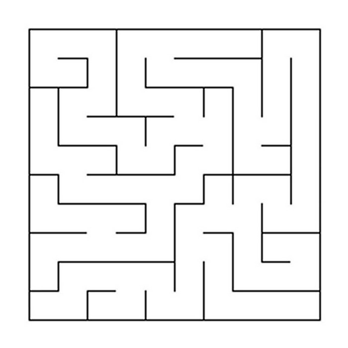
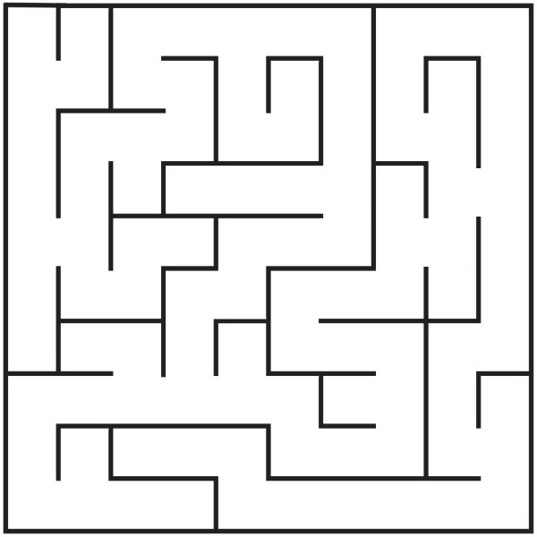
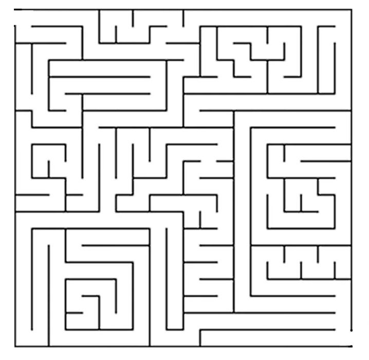

## Пример 1

```
10 10
0 0 1 0 0 0 0 1 0 1
0 1 1 1 0 0 0 1 1 1
1 0 1 0 0 1 1 1 1 1
1 0 0 1 0 0 1 0 1 1
0 0 1 0 1 0 1 0 1 1
1 0 0 0 0 1 1 0 1 1
0 0 0 1 1 0 0 1 0 1
0 0 0 0 1 0 1 1 0 1
1 0 0 0 1 1 1 0 0 1
0 1 0 1 0 1 0 0 0 1

0 1 0 0 0 1 1 1 0 0
1 1 0 0 1 1 1 0 0 0
0 0 1 1 1 0 0 0 0 0
0 1 1 0 0 1 0 0 1 0
1 0 1 1 1 0 1 1 1 0
0 1 1 1 0 1 0 0 0 0
1 1 0 1 0 0 1 0 1 1
0 1 1 1 1 0 0 0 1 0
1 0 1 0 0 0 0 1 1 1
1 1 1 1 1 1 1 1 1 1
```



## Пример 2

```
10 10
1 1 0 0 0 0 1 0 0 1
0 1 0 1 1 1 1 1 1 1
1 0 0 1 0 1 1 0 1 1
1 1 1 0 0 0 1 1 0 1
0 1 0 1 0 0 1 0 1 1
1 0 1 0 1 0 0 1 1 1
1 0 1 1 1 0 0 1 0 1
0 0 0 0 0 1 0 1 1 1
1 1 0 0 1 0 0 1 0 1
0 0 0 1 0 0 0 0 0 1

0 0 0 1 0 1 0 0 1 0
0 1 1 0 0 0 0 0 0 0
0 0 0 1 1 1 0 1 0 0
0 0 1 1 1 1 0 0 0 0
0 0 0 1 0 1 1 0 0 0
0 1 1 0 1 0 1 1 1 0
1 1 0 0 0 1 1 0 0 1
0 1 1 1 1 0 1 0 0 0
0 0 1 1 0 1 1 1 1 0
1 1 1 1 1 1 1 1 1 1
```



## Пример 3

```
20 20
0 0 0 0 1 0 1 0 0 1 0 0 0 0 0 0 0 0 0 1
0 0 0 1 1 1 0 1 0 0 1 1 0 0 1 0 1 1 0 1
1 0 0 1 0 0 0 0 0 0 1 1 0 1 0 1 1 1 1 1
1 1 0 0 0 0 0 0 1 0 1 0 1 0 1 0 1 1 1 1
1 1 0 0 0 0 0 0 1 1 0 0 0 0 1 0 0 1 1 1
0 1 0 1 0 0 0 0 1 1 0 0 0 0 0 0 0 0 0 1
1 0 0 1 0 0 0 0 0 1 0 0 1 0 0 0 0 0 0 1
0 0 0 1 0 1 0 1 0 0 0 0 1 1 0 0 0 0 0 1
1 0 1 1 1 1 1 1 1 0 0 0 1 1 1 1 0 0 0 1
1 1 0 1 1 1 1 0 1 1 0 0 1 1 1 0 0 0 0 1
0 0 1 0 1 0 1 0 0 1 0 0 1 1 0 1 0 1 0 1
0 0 1 0 1 1 0 1 0 0 0 1 1 1 1 1 1 0 1 1
0 0 0 0 0 0 0 0 0 1 1 0 1 1 1 0 0 0 1 1
1 0 1 0 0 0 0 1 1 1 0 0 1 1 0 0 0 0 0 1
1 1 1 0 0 0 0 1 1 1 0 0 1 1 0 1 0 1 0 1
1 1 0 0 0 0 1 1 1 1 0 0 1 1 1 0 1 0 1 1
1 1 1 0 0 1 1 1 1 1 0 0 1 1 0 0 0 0 0 1
1 1 1 0 1 1 1 1 1 1 0 0 1 0 0 0 0 0 0 1
1 1 1 0 1 0 1 1 1 1 0 0 0 0 0 0 0 0 0 1
0 1 0 0 0 0 0 1 0 0 1 0 0 0 0 0 0 0 0 1

0 1 1 1 0 0 0 0 1 0 0 1 1 1 1 1 1 0 1 0
1 1 1 0 0 1 1 1 0 1 1 0 0 1 0 0 0 0 0 0
0 0 1 1 1 1 1 1 1 1 0 0 1 0 1 1 0 0 0 0
0 0 1 1 1 1 1 1 0 0 1 1 0 1 0 0 1 0 0 0
0 0 0 1 1 1 1 1 0 0 1 1 1 1 1 1 1 1 1 0
1 0 1 0 1 1 1 1 1 0 0 1 1 1 1 1 1 1 1 1
0 1 1 1 0 1 1 1 1 1 1 1 1 0 1 1 1 1 1 0
0 1 1 0 0 0 0 0 0 1 1 1 0 0 0 1 1 1 1 1
0 0 0 0 0 0 0 0 0 0 1 0 1 0 0 0 0 1 1 1
0 1 1 0 0 0 0 1 1 0 0 1 1 0 0 1 1 1 1 0
1 1 0 1 0 0 1 0 1 1 1 1 0 0 0 0 0 0 1 0
1 1 1 1 1 0 1 1 1 1 0 0 0 0 0 0 1 1 0 0
0 1 1 1 1 1 1 1 0 0 1 1 0 0 0 1 1 1 1 0
0 0 0 0 1 1 1 1 0 0 0 1 1 0 1 1 1 1 1 1
0 0 0 1 1 1 1 0 0 0 1 1 0 0 0 0 0 0 0 0
0 0 0 1 1 1 0 0 0 0 0 1 1 0 0 1 1 1 1 1
0 0 0 0 1 0 0 0 0 0 1 1 0 0 1 1 1 1 1 0
0 0 0 1 0 0 0 0 0 0 1 1 1 1 1 1 1 1 1 0
0 0 0 1 1 1 1 0 0 1 0 1 1 1 1 1 1 1 1 0
1 1 1 1 1 1 1 1 1 1 1 1 1 1 1 1 1 1 1 1
```


