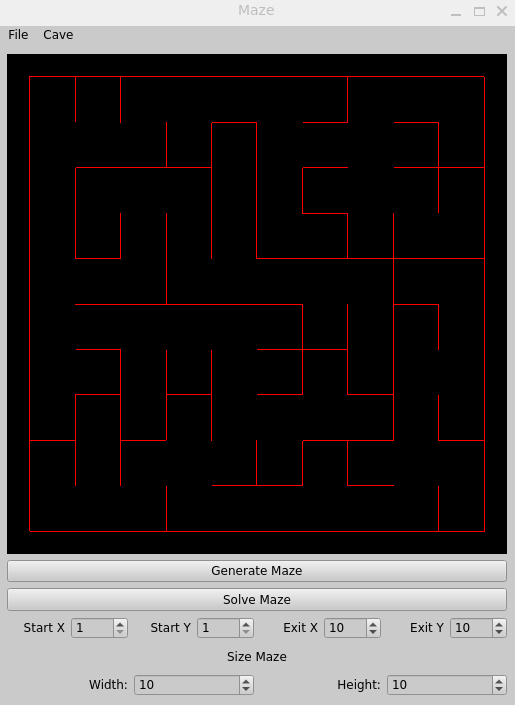
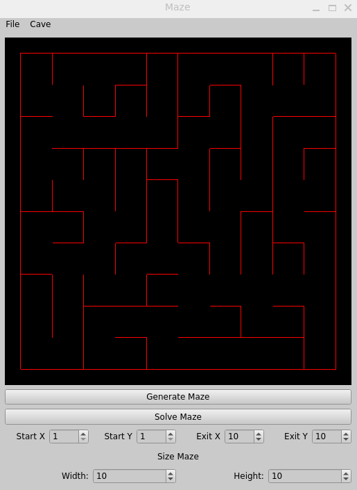
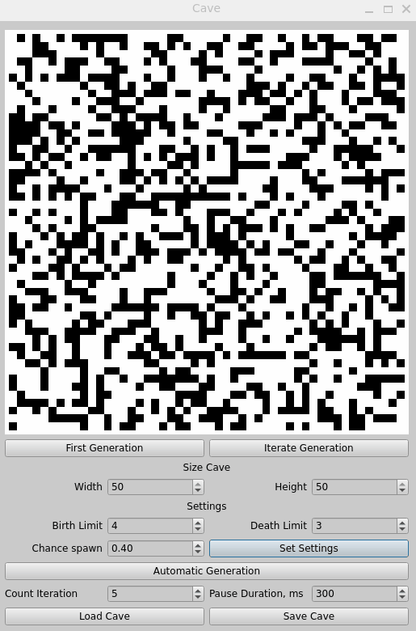

# Maze and Caves

<h1>Реализация программы по генерации и прохождению лабиринтов и пещер</h1>
<h2>Сборка</h2>
Для установки проекта на компьютере должны быть установлены зависимости:
- make
- gcc(g++)
- OpenGL
- CMake
- Qt6
- Qt6::Core
- Qt6::Gui
- Qt6::Widgets
- Qt6::OpenGLWidgets

Порядок действий для установки:
1. Скопируйте ссылку на [репозиторий](https://github.com/tokimiki4ika/MazeCaves-Game.git)
2. Склонируйте репозиторий и зайдите в папку src
3. Впишите в терминал `make` `install`

После установки на рабочем столе появится ярлык через который можно запустить приложение.

<h2>Работа приложения</h2>
На выбор можно сгенерировать новый или открыть существующий лабиринт в менюбаре 'File' 
Если сгенерировался лабиринт и он вам понравился, его можно сохранить в менюбаре 'File'

**Пример загрузки и сохранения лабиринта**

    

  

**Пример генерации и нахождения пути**

    

<h2>Дополнительное приложение Пещеры</h2>
В данном приложении можно генерировать и потихоньку итерировать генерацию пещеры 
На выбор можно сгенерировать новую или открыть существующую пещеру в менюбаре 'File' 
Если сгенерировалась пещера и она вам понравилась, ее можно сохранить в менюбаре 'File'

**Пример работы с пещерами**

    

В приложении Пещеры есть меню настроек для генерации:
- Лимит возраждения
- Лимит смерти
- Шанс спавна
После каждого изменения нужно нажать кнопку принятия настроек

Есть дополнительная функция автоматической итерации в генерации пещеры. 
Можно задать количество автоматических итераций и задержку между итерациями

Для остальных целей понадобятся зависимости:
- GTest
- doxygen
- clang-format
- lcov

<h2>Остальные цели</h2>
- open_app (Открыть приложение)
- uninstall (Удалить приложение и ярлык)
- tests (Запустить тестирование модели)
- gcov_report (Собрать отчет об покрытия кода тестами)
- dist (Собрать архив с всем исходным кодом)
- dvi (Собрать html документацию с помощью doxygen)
- rebuild (clean - install - open_app)
- style (Проверка исходного кода на соответствие Google Style)
- clean (Очистить репозиторий от всех выше перечисленных выходных файлов)
